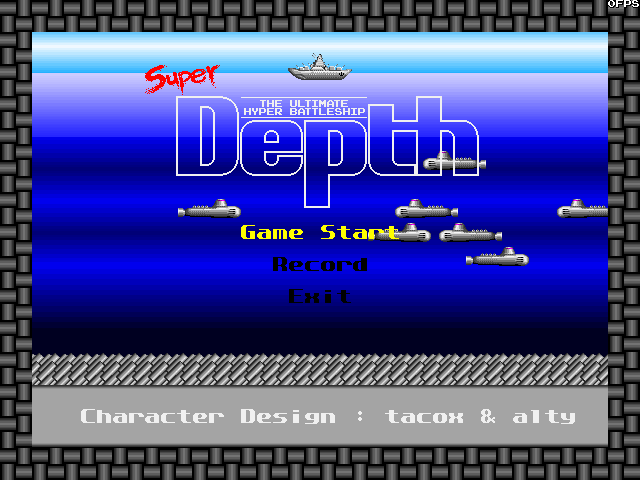
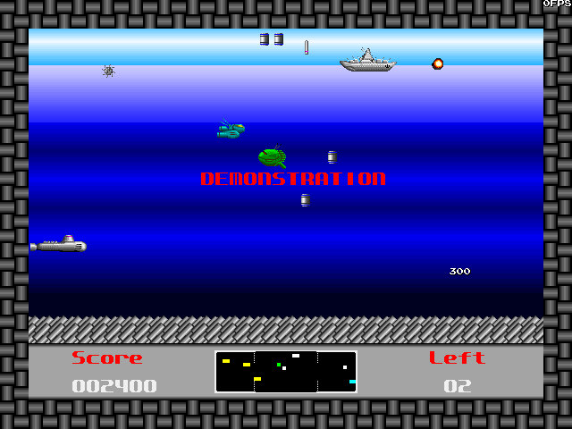
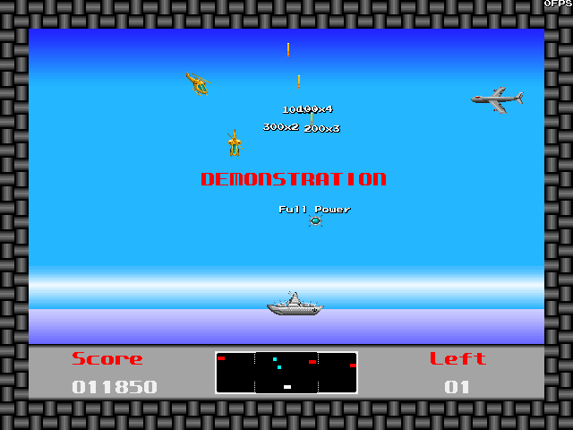
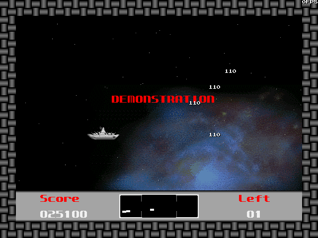
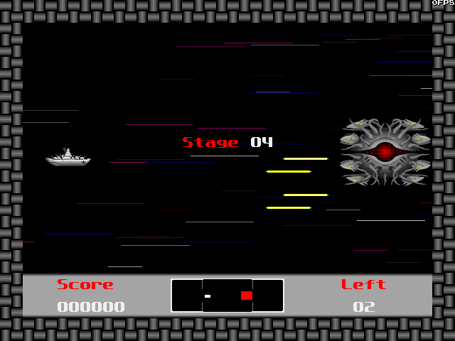
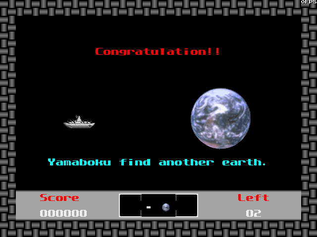
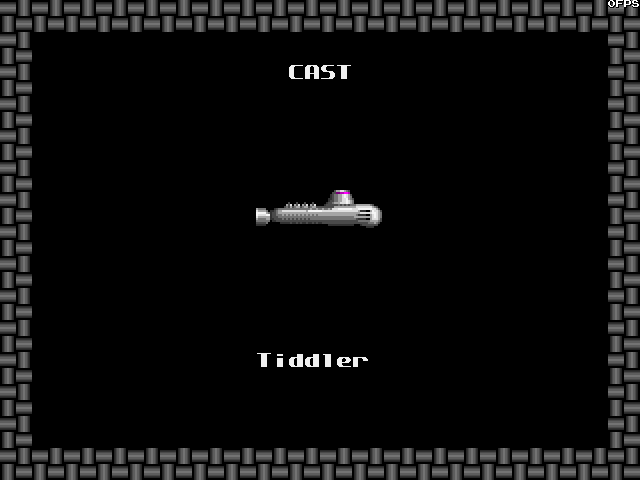
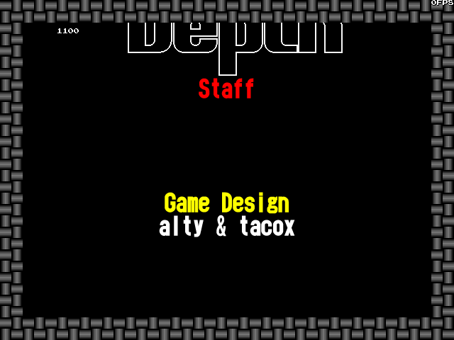

# Super Depth for Windows — WASM 移植

Bio_100% の『SuperDepth for Windows』（Build 115、1999-02-14）を解析して
C で書き直し、ブラウザで動かす。

```
Super Depth ver1.00a Copyright(c)1991 Hideki Mori and Yasuo Futatsugi
Copyright(C)1991 alty & tacox / Bio_100%
Copyright(C)1998-1999 Bio_100% Inc.
```

エミュレータではない。実行形式を Ghidra と自作の道具で読み、何をしている
関数なのかを確かめてから、同じ振る舞いをする C を手で書く。描画はソフト
ウェアラスタライズのみ（**WebGL は使わない**）。

**遊べます: https://yomei-o.github.io/super_depth_win_wasm/**

| | | | |
|---|---|---|---|
|  |  |  |  |
| タイトル | 海の面 | 空の面 | 宇宙の面 |
|  |  |  |  |
| 大物の面 | エンディング | CAST | スタッフロール |

海・空・宇宙の 3 枚は**原作の録画（`disk/demo1.dat`）を再生して撮った**
もの（`tmp/sd_shot.exe demo`）。原作の入力そのままで動いている画面。

海の面は <kbd>←</kbd><kbd>→</kbd> で艦を動かし、<kbd>Z</kbd> で船首側、
<kbd>X</kbd> で船尾側に爆雷を落とす。空と宇宙では上下にも動き、
<kbd>Z</kbd> と <kbd>X</kbd> が別々の向きの弾になる。<kbd>Esc</kbd> で
ポーズ。1 分放っておくと原作の録画（`demo1.dat`）が再生される。

同じやり方の前作: [soko_ban_wasm](https://github.com/yomei-o/soko_ban_wasm)、
[lord_monarch_wasm](https://github.com/yomei-o/lord_monarch_wasm)、
PC-98 版の [super_depth_wasm](https://github.com/yomei-o/super_depth_wasm)

## いまの状態

**面が 4 種類とも動き、輪になって回る。**
ロゴ → タイトル → 海 → 空 → 宇宙 → 大物 → また海 …。
沈められればゲームオーバー → 名前入力 → 得点表 → タイトル。
**エンディングとスタッフロールも動く**（原作と同じく、デバッグ
メニューからしか出られない —— 下記）。

* [x] **インストーラの解体** — `depth-build115.exe` から 45 ファイル
      （`python tools/unpack.py`、`disk/` に出る。三層ぜんぶ解いてあり、
      インストーラは走らせない。[docs/format.md](docs/format.md)）
* [x] **本体の見取り** — `disk/superdepth.exe` は PE32、MSVC 6.0、
      344KB（.text 242KB / 610 関数）。**描画は GDI の DIB**
      （`CreateDIBitmap` / `StretchDIBits` / `SetDIBitsToDevice` +
      `CreatePalette`）、音は `sndPlaySoundA`（WAV）と `mciSendCommandA`
      （MIDI）、入力は `GetAsyncKeyState` と `joyGetPos`。
      **DirectX は import に無く、`LoadLibraryA` で動的に読む** ——
      つまり移植の基準になる道は GDI のほうで、これは canvas に素直に乗る
* [x] **`.dar`（パターンの書庫）** — `FUN_00419700` と `FUN_0041a590` の
      とおりに読める。6 本とも末尾にぴったり着き、**画素は「透明の数・
      不透明の数・画素（4 の倍数に詰める）」の走の並び**
      （`python tools/dar.py disk/staff.dar sheet.png`）
* [x] **描画層** — `src/video.c`。640x480 の 8bpp、パターン描画（`y + 0x20`
      と原作のクリップつき）、原作のフォントの引きかた（`base + ASCII`）、
      行ごとに正弦でずらす描画（`vid_pat_wave`）、当たった敵の白い影
      （`vid_pat_flash`）、拡大縮小（`vid_pat_scale` と、左上を留める
      `vid_pat_scale_at`）、staff.dar の中央そろえフォント
      （`vid_text_centre`。**こちらは `base + ASCII - 0x20`**）
* [x] **BGM** — 原作の SMF を自前で合成する（`src/smf.c` / `src/synth.c` は
      user 自身の [windepth_wasm](https://github.com/yomei-o/windepth_wasm)
      から。同じ Bio_100% の WinDepth 用に書かれたもの）
* [x] **効果音** — 名前で引く 12 本（`disk/*.wav`）。ページが fetch して
      鳴らす。位置による左右も原作どおり
* [x] **状態機械**（`src/game.c`）— Bio ロゴ、海のタイトルとメニュー、
      記録画面、版とクレジット、デモの再生
* [x] **ゲーム本体**（`src/play.c`）— 艦・爆雷・敵 6 種・魚雷・砲弾・
      アイテム 7 種・連鎖・得点とポップアップ・レーダー・ステータス表示・
      面クリアの演出・ポーズ・ゲームオーバーの名前入力
* [x] **2 面目（空の面）**（`src/air.c`）— `FUN_0040c9e0` と
      そのクリア `FUN_0040f490`。艦は下で上に撃ち、飛行機 5 種が爆弾を
      落とす。クリアすると艦がロケットで宇宙へ上がる
* [x] **3 面目（宇宙の面）**（`src/space.c`）— `FUN_0040f970`。
      自機は上下左右に動いて左右に撃つ。出てくるものは乱数ではなく
      **`stage3.bin` の台本 275 手**で決まる。弾も敵と同じ配列に入る
* [x] **4 面目（大物）**（`src/boss.c`）— `FUN_00403dc0`。30 発で
      崩れて 8 つに割れ、**面番号が 1 に戻って海の面へ** —— 4 種類の面が
      輪になって回る（`disk/depth5.jpg` の画面）
* [x] **エンディング・CAST・スタッフロール**（`src/ending.c`）—
      `FUN_00408650` / `FUN_00408a80` / `FUN_00414210`。地球が右から流れて
      きて "Congratulation!!"、生き物 20 匹が名前つきで歩く CAST、
      そして staff.dar の 3 色フォントで組んだスタッフロール
      （`finst1.mid`）。**原作でも面クリアからは入れない** —— 窓に付く
      メニューが `menu_release` の方だから
* [x] **デバッグ メニュー**（`game_debug`）— 実行ファイルに残っている
      もう一方のメニュー資源（`MENU`）と、`0x426100` からの WM_COMMAND
      をそのまま。モードセレクト（ロゴ・タイトル・エンディング・
      スタッフロール）とステージセレクト（STAGE 01..12）、フルパワー、
      デモ再生・録画、当たり判定の枠（`FUN_00403520`。**枠は絵より
      0x20 上にずれる** —— 原作がそう描く）
* [x] **録画の書き出し**（状態 0x35 = `FUN_004031d0`）— 原作は
      `DEMO1.DAT` に書く。ページでは同じ名前でダウンロードに出すので、
      `disk/` に置けばそのままデモとして再生される
* [x] 得点表の保存 — 原作はレジストリ、ここはページの localStorage
* [x] `stage3.bin` — **3 面（宇宙）の台本**。0x20 の頭 + 24 バイト x 275。
      海と空の面の敵は `0x43fae8` の表、宇宙の面だけこのファイル

## 検査

```
sh tools/build.sh check
```

native の道具と検査を全部作って走らせ、PNG を `tmp/` に吐く。

| | |
|---|---|
| `tmp/dar_check.exe` | 6 本の `.dar` を歩いて末尾に着くか、行の走が幅に足りるか |
| `tmp/logo_check.exe` | Bio ロゴ（184 行の出し入れ、枠、ボタンで飛ばす） |
| `tmp/title_check.exe` | タイトル、メニュー、記録画面、デモへの落ち |
| `tmp/play_check.exe` | 面の作り、艦、爆雷と当たり、面クリア、ポーズ、名前入力、**原作の録画 `demo1.dat` を 8235 フレーム丸ごと再生**（沈まずに 4 面まで進み、記録切れで終わる —— 移植が合っている一番強い証拠） |
| `tmp/air_check.exe` | 空の面（移動・射撃・当たり・クリアの演出） |
| `tmp/space_check.exe` | 宇宙の面（台本 275 手・敵 12 種・弾・得点） |
| `tmp/boss_check.exe` | 大物の面（寄ってくる・弱点・30 発・8 つに割れて海へ戻る） |
| `tmp/ending_check.exe` | エンディング・CAST 20 匹・スタッフロール、デバッグ命令（面選び・当たり判定の枠・録画の書き出し） |
| `tmp/soak_check.exe` | 40 万フレーム適当に遊んで、数え間違い（枠の数・カーソル・面番号…）が出ないか。4 種類の面とエンディング 3 画面ぜんぶ通る |
| `tests/wasm_check.js` | WASM を node で動かして 1 枚描き、音が出ているか、**native と 1 バイトも違わないか** |

絵は `tmp/sd_shot.exe` で見る:

```
tmp/sd_shot.exe play  disk/depth.dar tmp/a.png 200   200 フレーム遊んだ画面
tmp/sd_shot.exe demo  disk/depth.dar tmp/d.png 5000  原作の録画を 5000 フレーム再生した画面
tmp/sd_shot.exe game  disk/depth.dar tmp/b.png 30    状態機械を 30 フレーム
tmp/sd_shot.exe sheet disk/depth1.dar tmp/c.png      パターン一覧
tmp/sd_shot.exe list  disk/depth.dar                 名前と大きさ
```

## 取り出したもの（`disk/`）

| | |
|---|---|
| `superdepth.exe` | 344064 バイト。本体 |
| `depth.dar` | 1335036。パターン 2887 枚 |
| `depth1.dar` / `depth2.dar` | 132072 ずつ。海と空のタイル。**`depth2.dar` は名前が binary 中で一度も参照されない**（0x443d38 に文字列だけある）ので、実際には読まれない |
| `space.dar` / `ending.dar` / `staff.dar` | 星雲・地球・Bio_100% のロゴ |
| `stage3.bin` | 6632。"SDEPTH" で始まる **3 面（宇宙）の台本**。`FUN_00413df0` が読む |
| `bgm01`..`bgm15.mid`, `finst1.mid` | BGM（SMF）。`finst1` はスタッフロール。表にある `finend2` だけ入っていない |
| `*.wav` | 効果音（RIFF）。表にある `plane` だけ入っていない |
| `depth2..5.jpg`, `ielike.gif`, `index.html` | HTML の取扱説明書。**作者自身が書いた仕様なので裏を取るのに使える** —— アイテムの色と中身、「海面と空面では横移動しかできません」、「全12面をクリアーするとエンディング…でも現在は４面までしか遊べません」 |
| `demo1.dat` | デモの記録（1 フレーム 1 バイト） |
| `ipatcfg.exe`, `ipatinfo.txt`, `readme.txt` | オンラインアップデート関係と説明 |

## 道具

```
python tools/unpack.py                      インストーラから disk/ を作る
python tools/globals.py FUN_0040f970        その関数が触る global を移植側と突き合わせる
python tools/menu.py                        実行ファイルの資源からメニューを読む（UTF-8 で保存して読むこと）
python tools/repng.py tmp/a.png docs/b.png  検査が吐いた PNG を zlib で詰め直す（308KB → 数 KB）
sh tools/cc.sh -O2 -Itools -o tmp/unlib.exe tools/unlib.c tools/blast.c
```

`tools/blast.c` / `blast.h` は Mark Adler の blast（zlib contrib、PKWare の
implode を解く）。`tools/unlib.c` がそれを呼ぶ小さな口。

Ghidra の作り直しは [RESUME.md](RESUME.md) に手順がある。
**`tools/ghidra/MakeThunkFuncs.java` を先に流すこと** —— 0x401005 の JMP 表
の飛び先は関数ポインタ経由でしか呼ばれず、素の解析では関数にならない。

## 決まりごと

* **GUI の窓を開かない。** 確認は PNG に描いて読む
* **WebGL 禁止**（対象機に無い）
* **インストーラは走らせない。** 中身は解いて取り出す
* **推測で埋めない。** 分からない所は `out/superdepth.c` を読み直すか、
  分からないと書く
* Bash のヒアドキュメントはバックスラッシュを食う。`\n` を含むものは
  Write/Edit で書く
* `depth-build115.exe` は git に入れない（`tools/unpack.py` で再現できる）。
  `disk/` の中身は入れる
